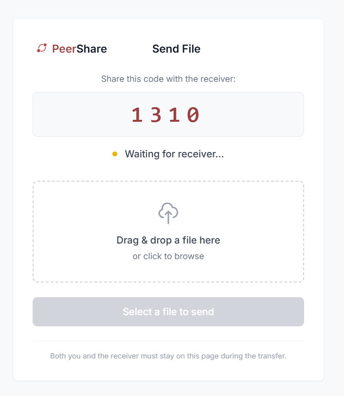
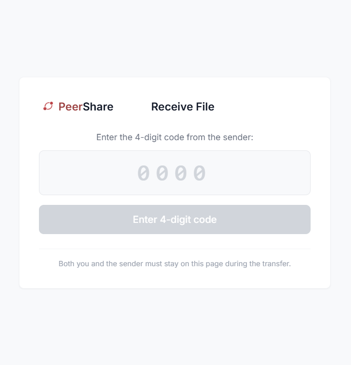

# PeerShare

A real-time, peer-to-peer file sharing application leveraging WebRTC DataChannels for secure, direct browser-to-browser transfers with zero server-side file handling.

---

<p align="center">
  
  
</p>


## Overview

PeerShare eliminates the traditional upload-download paradigm by establishing direct connections between peers. Files are transmitted through encrypted WebRTC DataChannels, ensuring data never traverses third-party servers.

```
Traditional:  Sender → Server → Receiver (2x latency)
PeerShare:    Sender ←→ Receiver (direct P2P)
```

---

## Tech Stack

| Layer | Technology |
|-------|------------|
| **Frontend** | React 18, Vite 5, Tailwind CSS 3.4 |
| **Signaling** | Node.js, WebSocket (ws) |
| **Transport** | WebRTC DataChannels |
| **Routing** | React Router DOM 6 |

---

## Features

### Core Functionality
- **WebRTC DataChannel Transfer** - Binary data streams directly between browsers via SCTP
- **WebSocket Signaling Server** - Lightweight signaling for SDP/ICE exchange only
- **Chunked File Transfer** - Large files split into chunks for reliable transmission
- **Real-Time Progress Tracking** - Live transfer progress with React state management

### User Experience
- **4-Digit Room Codes** - Simple peer discovery mechanism
- **Drag & Drop Interface** - Intuitive file selection with `FileDrop` component
- **Progress Visualization** - Custom `ProgressBar` component for transfer status
- **No Authentication Required** - Instant, frictionless sharing

### Performance & Security
- **End-to-End Encryption** - DTLS-SRTP encryption on all WebRTC connections
- **No Server Storage** - Zero file data passes through the signaling server
- **LAN Optimization** - Direct local network routing for maximum speed
- **No File Size Limits** - P2P architecture removes server-imposed restrictions

---

## Architecture

```
┌─────────────────┐         ┌─────────────────┐         ┌─────────────────┐
│     SENDER      │   WS    │    SIGNALING    │   WS    │    RECEIVER     │
│    (React)      │◄───────►│     SERVER      │◄───────►│    (React)      │
│   Send.jsx      │         │   (Node.js)     │         │  Receive.jsx    │
└────────┬────────┘         └─────────────────┘         └────────┬────────┘
         │                                                       │
         │              WebRTC DataChannel (P2P)                 │
         └───────────────────────────────────────────────────────┘
                              File Transfer
```
## Socket Flow

<p align="center">
  
</p>


---

